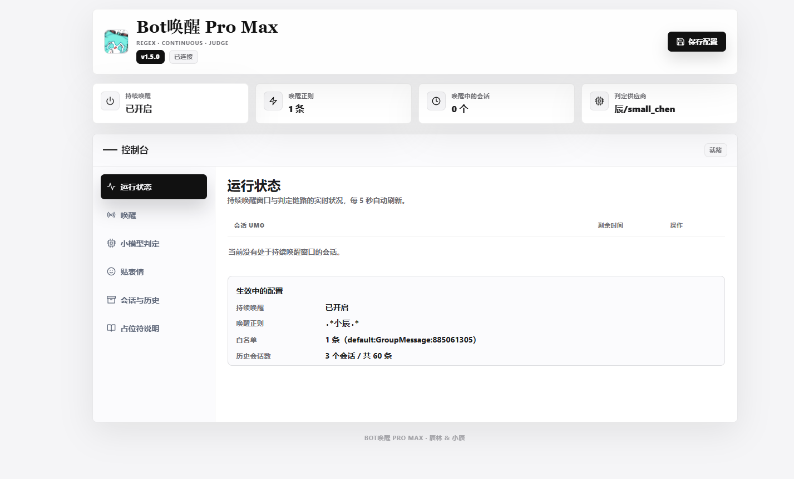

# astrbot_plugin_regex_trigger_pro_max

**融合三个插件的 Pro Max 融合怪，自带 WebUI 控制台，装这一个就够：**

| 融合来源 | 拿来了什么 |
| --- | --- |
| `astrbot_plugin_wake_enhance` | 正则唤醒 / 持续唤醒 |
| `should_I_respond` | 小模型二次判定（该不该回） |
| `astrbot_plugin_iamthinking` | 处理状态贴表情（并修掉了原版判定前就贴的老毛病） |

在此之上还加了自带 WebUI 控制台与更多判定策略。

## WebUI 控制台



v1.1.0 起自带终端风控制台（页面机制参考 AstrNa 的插件页面实现）：AstrBot WebUI → 插件管理 → Bot唤醒Pro Max → 插件页面。可以在页面上直接编辑全部配置并即时生效（免重载），还能实时看到持续唤醒窗口里的会话、剩余时间，并一键踢出。需要较新的 AstrBot（支持插件页面 API），旧版会自动跳过 WebUI 注册，其余功能不受影响。

## 为什么要融合

三个插件分开装的时候，流程是割裂的：

- wake_enhance 只管把 `is_at_or_wake_command` 置成 True，不区分是正则蹭到的还是真被 @ 了
- should_I_respond 不管唤醒来源，一律丢给小模型判一遍，被直接 @ 也可能判成不回，白烧 token 还显得不理人
- iamthinking 把「思考中」表情挂在判定**之前**的钩子上，凡进 LLM 阶段就贴——被小模型拦下不回的消息也先贴了表情，而且之后再没人给它收尾，干等两分钟变成「失败」表情，群友看着一头雾水

融合之后各自的老毛病都修了。

### 唤醒来源

引入了**唤醒来源**的概念：

| 来源 | 含义 | 判定提示 |
| --- | --- | --- |
| `native` | @ 你、唤醒前缀、指令 | 告诉小模型这条是直接点名，通常该回 |
| `regex` | 命中唤醒词正则 | 告诉小模型这是软唤醒，谨慎判断 |
| `continuous` | 处于持续唤醒窗口内 | 告诉小模型可能只是群友闲聊，谨慎判断 |

三种来源都会走一遍小模型，只是给的上下文不同。

来源会一并塞进判定提示词的 `{awakening_context}`，小模型知道这条是「软唤醒」还是「被点名」，判得更准。

## 执行流程

```
消息进来
  ↓
wake_listener  正则匹配 / 持续窗口判定 → 标记唤醒来源
  ↓
AstrBot 决定要不要调 LLM
  ↓
interest_analyzer  按来源决定是否调小模型
  ↓  should_reply=false → stop_event，不回（一个表情都不会贴）
  ↓  should_reply=true  → 注入 interest / feeling
emoji_start_thinking  贴「思考中」表情，启动超时兜底
  ↓
主模型生成回复（调工具时表情切「工具中」，用完切回）
  ↓
save_llm_reply_to_history  回复入自管历史
  ↓
emoji_finish  表情换「完成」；超时未回完则换「失败」
```

## 贴表情反馈（v1.5.0，融合自 iamthinking）

判定通过、真正开始调主模型的那一刻，给触发消息贴「思考中」表情，之后按处理进度自动切换：

| 状态 | 时机 | 默认表情 ID |
| --- | --- | --- |
| 思考中 | 小模型判要回、开始调主模型 | 66 |
| 工具中 | 主模型调用函数工具（搜网页等） | 270 |
| 完成 | 回复发出 | 74 |
| 失败 | 超过超时时间还没回完 | 264 |

相比 iamthinking 原版的关键差异：原版挂在判定**之前**的 `on_waiting_llm_request`，凡进 LLM 阶段就贴，被小模型拦下的消息也贴、且表情再也没人收尾；本融合版把挂点改到 `on_llm_request(priority=-100)`（判定钩子是 priority=10，先跑），**判定拦下的消息事件直接终止，贴表情钩子根本不会执行**。被拦的消息零表情、零残留。

其他说明：

- 仅支持 aiocqhttp（QQ 协议端）群聊；表情 ID 列表留空 = 该阶段不贴，各阶段表情和超时时长都在 WebUI / 配置面板的 `emoji` 组里改
- 超时兜底只换表情不干预回复，主模型慢悠悠回出来后还会把表情修正成「完成」
- 判定本身耗时不算在超时窗口内（超时从判定通过才开始计）

## 配置要点

- `waking_regex`：唤醒正则，改完保存后重载插件生效，坏正则会跳过而不是整条流程炸掉
- `whitelist`：全插件唯一白名单，填 UMO，**留空 = 不限制**，正则唤醒 / 持续唤醒 / 小模型判定都受它管
- v1.3 起配置按功能分组：`waking_regex` / `continuous_awakening` / `analysis`（判定供应商 `analysis.provider_id`、失败兜底 `analysis.fail_policy` 等）/ `emoji`（贴表情）/ `session`（白名单、历史）；旧版平铺键会在加载时自动迁移
- `analysis.provider_id`：判定用的小模型，留空则自动回退到当前默认供应商（通常是主模型）跑判定，不会静默放行
- `analysis.fail_policy`：判定挂了（调用失败 / 输出不是合法 JSON）时的兜底，allow 放行、block 拦下；判定输出已做鲁棒解析，能剥掉 markdown 围栏和前后废话
- 判定 JSON 新增 `exit_wake` 字段：小模型发现自己没被注意时可以输出 `exit_wake: true` 主动退出持续唤醒窗口，本条回不回仍由 `should_reply` 决定（允许回完最后一句再退场）
- 被点名不跳过判定：任何唤醒方式都会走一遍小模型
- `inject_emotion`：关掉就只做拦不拦，不改 prompt

## 与原插件的差异

- 唤醒正则从 `re.match` 改成 `re.search`，`.*小辰.*` 这种写法不写星号也能命中
- 正则预编译，写错的表达式只跳过该条并打日志
- 群号统一转字符串比对，避免配置里填成数字导致白名单失效
- 历史记录落盘路径改为 `data/rtpm_interest_history.json`，不和原插件抢文件
- 历史记录多存了 `wake_source` 字段，翻文件就能看出每条是怎么被唤醒的
- `_save_history` 收进 `finally`，分析中途抛异常也不丢记录
- 不注册任何斜杠指令，全部行为由配置面板控制

## 注意

装这个之前请先把 `astrbot_plugin_wake_enhance`、`should_I_respond` 停用，否则唤醒判定会跑两遍；装了 `astrbot_plugin_iamthinking` 的话也请停用其一，否则同一条消息会被贴两份表情（互不冲突，但纯粹是重复）。

判定过程会在日志里留下完整痕迹（搜 `RTPM`）：`开始判定（来源 / 供应商）` → `判定模型原始回复` → `判定不回复 / 已注入情绪状态`。只看到「开始判定」没有「原始回复」说明调用挂了，连「开始判定」都没有说明判定环节根本没进。贴表情的状态切换日志搜 `RTPM-Emoji`。
